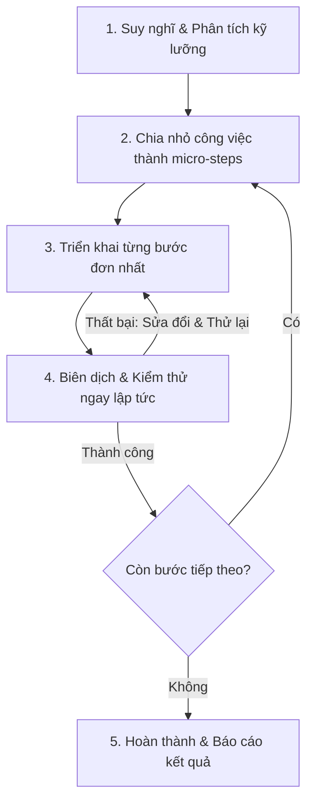

# QUY TRÌNH PHÁT TRIỂN VÀ NGUYÊN TẮC HOẠT ĐỘNG (DEVELOPMENT PROCESS & WORKING PRINCIPLES)

Tài liệu này xác lập quy trình làm việc nghiêm ngặt và nguyên tắc hoạt động áp dụng cho toàn bộ các công việc phát triển, nâng cấp và sửa lỗi trong dự án **Parking Building Management System (PBMS)**.

---

## 1. Quy Trình Làm Việc Nghiêm Ngặt (Core Workflow)

Mọi nhiệm vụ phát triển phần mềm trong dự án này phải tuân thủ tuyệt đối quy trình 5 bước sau:

### Bước 1: Suy nghĩ & Phân tích kỹ lưỡng (Analyze First)
*   **Hành động**: Đọc mã nguồn hiện tại, xác định cấu trúc dữ liệu bị ảnh hưởng, phân tích luồng sự kiện (Event-driven) và các mối liên kết giữa các Microservices.
*   **Mục tiêu**: Nắm rõ tác động của thay đổi đối với toàn hệ thống trước khi gõ bất kỳ dòng code nào.

### Bước 2: Chia nhỏ công việc (Decompose Tasks)
*   **Hành động**: Viết ra danh sách các bước cực kỳ nhỏ cần thực hiện (Micro-steps). 
*   **Mục tiêu**: Mỗi bước chỉ thực hiện một thay đổi cụ thể (ví dụ: tạo file mẫu, cấu hình Dependency Injection, thêm thuộc tính DB, viết endpoint...).

### Bước 3: Triển khai đơn nhất (Single-task Focus)
*   **Hành động**: Tập trung hoàn thành duy nhất một bước đã chia nhỏ. Không thực hiện song song nhiều tính năng hay gộp việc sửa lỗi vào tính năng mới.
*   **Mục tiêu**: Đảm bảo tính tập trung và kiểm soát chặt chẽ mã nguồn.

### Bước 4: Kiểm thử & Chạy thử ngay (Test Immediately)
*   **Hành động**: Biên dịch dự án (`dotnet build`), kiểm tra lỗi cú pháp, chạy thử API hoặc kiểm tra log của dịch vụ ngay sau khi xong bước đó.
*   **Mục tiêu**: Đảm bảo lỗi được phát hiện và sửa ngay tại chỗ trước khi mã nguồn trở nên phức tạp hơn.

### Bước 5: Lặp lại và Chuyển bước (Iterate & Move Forward)
*   **Hành động**: Chỉ chuyển sang bước tiếp theo khi bước hiện tại đã chạy ổn định và không phát sinh lỗi. Lặp lại đúng chu kỳ cho đến khi hoàn thành mục tiêu lớn.

---

## 2. Vai Trò & Nguyên Tắc Hoạt Động (Role Rules)

### 2.1. Đối với AI Coding Assistant (Antigravity)
*   **Nhiệm vụ**: Đóng vai trò là Kỹ sư phát triển chính xác, tuân thủ Clean Architecture và các quy tắc sản xuất của hệ thống.
*   **Hành động bắt buộc**:
    1.  Không tự ý viết code hàng loạt mà không giải thích các bước nhỏ.
    2.  Luôn đề xuất kế hoạch thực hiện dưới dạng danh sách việc cần làm (Todo List) và đánh dấu tiến độ sau mỗi bước.
    3.  Chạy kiểm tra biên dịch (`dotnet build`) thường xuyên sau mỗi thay đổi lớn.
    4.  Cung cấp liên kết trực tiếp (Clickable Links) đến các file được chỉnh sửa để người dùng dễ theo dõi.

### 2.2. Đối với Người dùng (Developer / Partner)
*   **Nhiệm vụ**: Đóng vai trò là người giám sát, phê duyệt kế hoạch (Implementation Plan) và hỗ trợ vận hành hạ tầng (Docker, Cổng kết nối).
*   **Hành động khuyến khích**: Phản hồi nhanh chóng các bước thử nghiệm và xác nhận kết quả chạy thực tế để tiến hành bước tiếp theo.

---

## 3. Thiết lập Môi trường & Quy chuẩn Kỹ thuật (Workspace Rules)

Để hỗ trợ quy trình kiểm thử nhanh ở mỗi bước nhỏ, các quy chuẩn sau đây được thiết lập cho Workspace:

*   **Tính độc lập của Service**: Mỗi Microservice phải có khả năng tự khởi động độc lập. Khi thiếu các hạ tầng Docker như Redis hay RabbitMQ, các dịch vụ phải tự động chuyển sang chế độ **InMemory Fallback** để không cản trở quá trình dev/test logic.
*   **Quy tắc Đặt tên & Cấu trúc file**:
    *   Tất cả các Model, Controller, DTO, Command/Query phải đặt đúng vị trí thư mục theo kiến trúc Clean Architecture hoặc CQRS pattern đã xác định trong dự án mẫu.
    *   Sử dụng múi giờ UTC chuẩn quốc tế (`DateTime.UtcNow`) cho toàn bộ giao tiếp Event và ghi dữ liệu xuống database.
*   **Cơ chế Quản lý tiến độ**: Sử dụng file `task.md` tại thư mục artifacts của bộ não để ghi lại danh sách checklist động và cập nhật trạng thái liên tục:
    *   `[ ]` Chưa thực hiện.
    *   `[/]` Đang thực hiện.
    *   `[x]` Đã hoàn thành và kiểm thử thành công.
